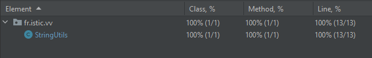
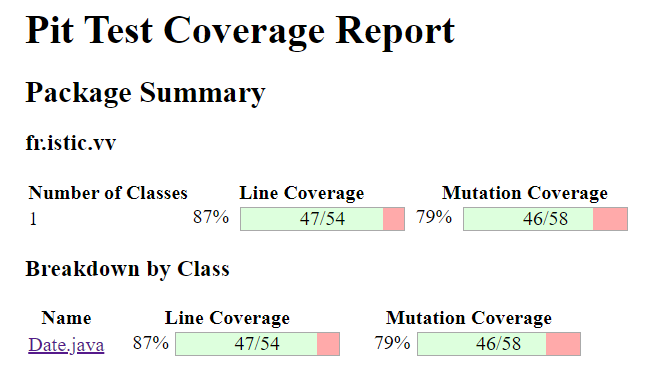

# Balanced strings

A string containing grouping symbols `{}[]()` is said to be balanced if every open symbol `{[(` has a matching closed symbol `)]}` and the substrings before, after and between each pair of symbols is also balanced. The empty string is considered as balanced.

For example: `{[][]}({})` is balanced, while `][`, `([)]`, `{`, `{(}{}` are not.

Implement the following method:

```java
public static boolean isBalanced(String str) {
    ...
}
```

`isBalanced` returns `true` if `str` is balanced according to the rules explained above. Otherwise, it returns `false`.

Use the coverage criteria studied in classes as follows:

1. Use input space partitioning to design an initial set of inputs. Explain below the characteristics and partition blocks you identified.
2. Evaluate the statement coverage of the test cases designed in the previous step. If needed, add new test cases to increase the coverage. Describe below what you did in this step.
3. If you have in your code any predicate that uses more than two boolean operators, check if the test cases written so far satisfy _Base Choice Coverage_. If needed, add new test cases. Describe below how you evaluated the logic coverage and the new test cases you added.
4. Use PIT to evaluate the test suite you have so far. Describe below the mutation score and the live mutants. Add new test cases or refactor the existing ones to achieve a high mutation score.

Write below the actions you took on each step and the results you obtained.
Use the project in [tp3-balanced-strings](../code/tp3-balanced-strings) to complete this exercise.

## Answer

```java
    public static boolean isBalanced(String str) {
            Stack<Character> stack = new Stack<>();
    
            for (char c : str.toCharArray()) {
                if (c == '{' || c == '[' || c == '(') {
                    stack.push(c);
                } else if (c == '}' && !stack.isEmpty() && stack.peek() == '{') {
                    stack.pop();
                } else if (c == ']' && !stack.isEmpty() && stack.peek() == '[') {
                    stack.pop();
                } else if (c == ')' && !stack.isEmpty() && stack.peek() == '(') {
                    stack.pop();
                } else {
                    return false;
                }
            }
            return stack.isEmpty();
        }
```

### 1. Input Space Partitioning:

|Symbols|Result|Reason|
| :---: | :---: | :---: |
|Empty | True | -- |
|Null |False| Null input string|
|{ |False |Unmatched opening symbols|
|} |False| Unmatched closing symbols|
|[ ] |True| -- |
|{()}| True | -- |
|{)(| False |Mixed symbols with an incorrect order|

### 2. Statement Coverage:





### 3. Base Choice Coverage:

!stack.isEmpty() : Covered by cases where closing symbols are encountered
after opening symbols, such as ```assertTrue(StringUtils.isBalanced("{[()]}"));```

stack.peek() == '{' : This is covered by test cases like ``` assertTrue(StringUtils.isBalanced("{[()]}"));```

### 4. Mutation Tetsing PIT




For the line coverage our score is pretty acceptable, however about mutation coverage, it is a little bit low.
